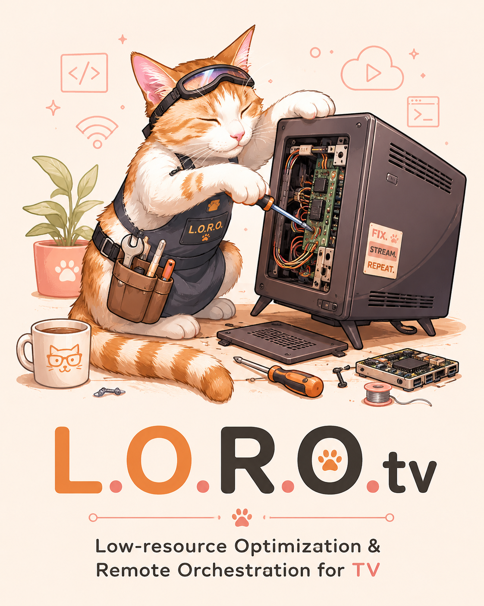

# 🐈‍⬛ L.O.R.O-TV 📺

**L**ow-resource **O**ptimization & **R**emote **O**rchestration for **TV**



> "Porque se a TV tem 1GB de RAM, ela precisa da agilidade de um gato, não da lerdeza de um sistema cheio de ads."

---

## 🧠 O que é este projeto?

Smart TVs Android vêm recheadas de **bloatware** — aplicativos pré-instalados que você nunca pediu: telemetria, anúncios, assistentes de voz e serviços de terceiros. Tudo isso consome **memória RAM**, **CPU** e mantém o **ZRAM** (compressão de memória) sob pressão constante, deixando a TV lenta.

Este projeto é um kit de ferramentas **DIY** para otimização radical de Smart TVs Android (foco em **TCL** com chipset **MediaTek**). Usamos acesso via **ADB** (Android Debug Bridge) para desativar esses serviços e liberar recursos do sistema.

---

## ⚙️ Como funciona o ADB?

O **ADB** (Android Debug Bridge) é uma ferramenta de linha de comando que permite comunicação com dispositivos Android pelo USB ou rede (Wi-Fi). Ele tem arquitetura cliente-servidor:

```
[Seu PC] --ADB--> [TV Android]
```

- `adb connect IP:5555` — Conecta à TV via rede
- `adb shell <comando>` — Executa comandos Linux diretamente no Android
- `adb install <apk>` — Instala aplicativos
- `adb push <arquivo>` — Copia arquivos para o dispositivo

Os scripts `.sh` neste projeto rodam **dentro da TV** via `adb shell`.

---

## 📂 Estrutura do Projeto

```
lorotv/
├── README.md
├── header.png
├── install_projectivity.ps1    # Script PowerShell para instalar o Projectivy Launcher
├── tcl/
│   ├── debloat_tcl.sh          # Script de desativação de bloatware (roda na TV)
│   └── rollback_tcl.sh         # Script de reversão (reativa tudo)
```

---

## 🛠️ Script 1: `tcl/debloat_tcl.sh` — O Caçador

**O que faz:** Desativa (não desinstala) pacotes de bloatware e reduz animações do sistema.

### 🔍 Pacotes desativados — o que cada um faz?

| Pacote | Função | Motivo do bloqueio |
|--------|--------|-------------------|
| `com.tcl.waterfall.overseas` | Feed de anúncios / conteúdo sugerido da TCL | Consome RAM e banda |
| `com.tcl.guard` | Segurança / scan de apps TCL | Processo em segundo plano desnecessário |
| `com.tcl.esticker` | Figurinhas / overlays na UI | Bloatware visual |
| `com.tcl.smartalexa` | Integração com Alexa | Assistente de voz, raramente usado |
| `com.tcl.usercenter` | Central do usuário TCL | Telemetria e sync |
| `com.tcl.dashboard` | Painel de controle TCL | Consome RAM ociosa |
| `com.tcl.ttvs` | Serviço de TV TCL (recomendações) | Consome CPU em background |
| `com.google.android.videos` | Google Play Filmes | Bloatware Google |
| `com.google.android.youtube.tvmusic` | YouTube Music TV | Streaming de música que você não pediu |
| `com.google.android.katniss` | Google Assistant na TV | Assistente de voz pesado |
| `com.google.android.tvrecommendations` | Recomendações na tela inicial | Mantém a CPU ativa à toa |

### ⚡ Por que desativar em vez de desinstalar?

O comando `pm disable-user --user 0 <pacote>` apenas **marca o pacote como desativado** para o usuário principal (0). O APK continua existindo no sistema. Isso é **seguro e reversível** — não é necessário root e você pode reativar tudo com `pm enable`.

### 🎬 Animações zeradas

```sh
settings put global window_animation_scale 0
settings put global transition_animation_scale 0
settings put global animator_duration_scale 0
```

Animações de janelas, transições e durações são configuradas para **0** (desligadas). Isso dá a sensação de **resposta instantânea** — a TV não fica "esperando" animações terminarem.

---

## 🔄 Script 2: `tcl/rollback_tcl.sh` — A Soneca

**O que faz:** Reverte **tudo** que o `debloat_tcl.sh` fez.

Usa `pm enable` para reativar os pacotes e restaura as animações para o valor padrão (`1.0`).

> ⚠️ Use este script se precisar de suporte técnico oficial ou se a interface da TV apresentar comportamentos inesperados.

---

## 📦 Script 3: `install_projectivity.ps1` — O Instalador (PowerShell)

**O que faz:** Automatiza a instalação do **Projectivy Launcher** — um launcher alternativo limpo e rápido — e desativa o launcher padrão da Google.

### 🧩 Conceitos PowerShell abordados:

- **`param()`** — Bloco de parâmetros do script
- **`Write-Host`** — Saída colorida no terminal
- **`Invoke-WebRequest`** — Download de arquivos via HTTP
- **`Test-Path`** — Verifica se arquivo existe
- **`Read-Host`** — Entrada do usuário
- **`$LASTEXITCODE`** — Código de saída do último comando

### 🔧 Conceitos ADB abordados:

- **`adb connect`** — Estabelece conexão TCP/IP com a TV
- **`adb install -r`** — Instala (ou reinstala) um APK
- **`adb shell am start`** — Invoca uma Activity específica via **Intent** do Android
- **`adb shell pm disable-user`** — Desativa pacotes do sistema
- **`adb reboot`** — Reinicia o dispositivo

### 📌 Entendendo o `am start`

```powershell
adb shell am start -n "com.spocky.projengmenu/.activities.SettingsActivity"
```

- `am` = **Activity Manager** — gerenciador de atividades do Android
- `start` = inicia uma Activity
- `-n` = nome completo do componente (pacote + classe)
- Isso abre a tela de configurações do Projectivy para que o usuário ative a opção "Substituir Launcher Padrão"

---

## 🚀 Guia de Uso

### 1. Preparação

Habilite o **Modo Desenvolvedor** na sua TV TCL:
1. Configurações > Preferências do Dispositivo > Sobre > Versão (clique 7 vezes)
2. Volte para Configurações > Preferências do Dispositivo > Opções do Desenvolvedor
3. Ative **Depuração USB**

Conecte-se via rede:
```powershell
adb connect IP_DA_TV:5555
```

### 2. Aplicar otimizações

```powershell
# Copia os scripts para a TV
adb push tcl/debloat_tcl.sh /data/local/tmp/
adb push tcl/rollback_tcl.sh /data/local/tmp/

# Executa o debloat
adb shell /system/bin/sh /data/local/tmp/debloat_tcl.sh
```

### 3. (Opcional) Instalar Projectivy Launcher

```powershell
.\install_projectivity.ps1
```

### 4. Reboot

```powershell
adb reboot
```

---

## 📊 Monitoramento

Para ver o efeito das otimizações em tempo real:

```powershell
# Ver processos ordenados por uso de memória
adb shell top -m 20 -s 9

# Ver status do ZRAM
adb shell cat /proc/swaps
adb shell cat /proc/meminfo | findstr ZRAM
```

---

## 🧪 Testando sem risco

Os scripts usam `pm disable-user` (não `pm uninstall`). Para reverter:

```powershell
adb shell /system/bin/sh /data/local/tmp/rollback_tcl.sh
```

Se algo der errado e você perder acesso ao ADB, um **reset de fábrica** restaura tudo ao normal.

---

## 📜 Licença

Feito com 🐾 por um desenvolvedor de Belém para todos que se recusam a aceitar hardware lento.

**Miau.**
